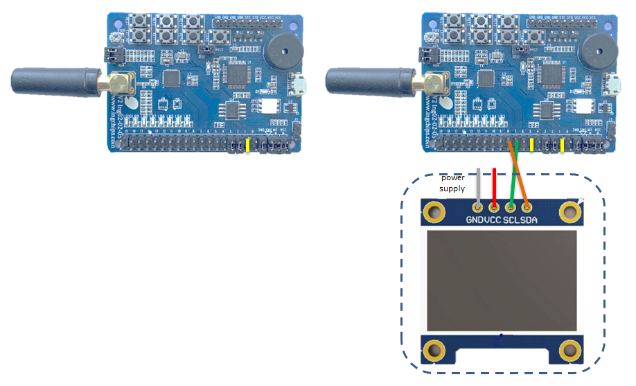

# Throughput

_Peripheral Throughput_ & _Central Throughput_ use _INGCHIPS Throughput Service_ for testing.

Two test modes are implemented:

1. **Throughput Mode**

    _Central_ and _Peripheral_ try their best to achieve the peak throughput in a single
    direction or both directions simultaneously.

    To achieve the peak throughput from _Peripheral_ to _Central_, _Peripheral_ needs to push
    as much data as possible into BLE stack, like:

    ```c
    void send_data(void)
    {
        uint16_t len = att_server_get_mtu(handle_send) - 3;
        while (att_server_notify(handle_send, HANDLE_GENERIC_OUTPUT, (uint8_t *)0x0, len) == 0) ;
        att_server_request_can_send_now_event(handle_send);
    }
    ```

    To achieve the peak throughput from _Central_ to _Peripheral_, _Central_ also needs to push
    as much data as possible into BLE stack, like:

    ```c
    void send_data(void)
    {
        while (gatt_client_write_value_of_characteristic_without_response(slave.conn_handle,
                    slave.input_char.value_handle, send_packet_len, (uint8_t *)0x0) == 0) ;

        att_dispatch_client_request_can_send_now_event(slave.conn_handle);
    }
    ```

    Here, `0x0` is a valid address in SoC, and its content is irrelevant to this test.

1. **Loopback Mode**

    _Central_ sends a block of data to _Peripheral_ who bounces it back to _Central_. _Central_
    checks the content and measures the round trip time.

Mode of _Peripheral_ is controlled by Key 1: keep Key 1 **released** and reset, then it will run in
throughput mode; while keep Key 1 **pressed** and reset, it will run in throughput mode.
Mode of _Central_ is controlled by entering commands through the default UART interface.

## Hardware Setup

Take ING918xx Dev-Board as an example:

* _Peripheral_ (Left):

    Jumper for Key 1 needs to be connected

* _Central_ (Right):

    Optionally, jumper for Key 1 & Key2 can be connected, and a 128x64 OLED display driven by SSD1306
    can also be connected. Key 1 & 2 are used for start/stop throughput test on two directions respectively,
    and the OLED is used for displaying statistical information by defining `USE_DISPLAY`.



## Test Commands

_Central_ supports following commands (ref to [`uart_console.c`](../src/uart_console.c)).

### Connection Parameters

1. `phy`: modify PHY

    `phy PHY`: `PHY` can be `1m`, `2m`, `s2` or `s8`

    When `s2` or `s8` is used, _Central_'s Tx PHY is changed to `s2` or `s8` respectively;
    _Peripheral_'s PHY is changed to Coded, but `s2` or `s8`  can not be controlled by this command.
    Use `ll_set_conn_coded_scheme` in _Peripheral_ to control coded scheme.

1. `interval`: modify connection interval

    `interval X`: change interval to $ X \times 1.25ms $

### Throughput Test Control

For throughput test, _Peripheral_ must be put into throughput mode

1. `start`

    * `start s->m`: start throughput testing from _Peripheral_ to _Central_
    * `start m->s`: start throughput testing from _Central_ to _Peripheral_

    Test on both directions can be started simultaneously.

1. `stop`

    * `stop s->m`: stop throughput testing from _Peripheral_ to _Central_
    * `stop m->s`: stop throughput testing from _Central_ to _Peripheral_

### Loopback Test Control

For loopback test, _Peripheral_ must be put into loopback mode.

1. `loopback`

    * `loopback start`: start loopback test
    * `loopback stop`: stop loopback test

When each round of loopback test is done, round trip time & RSSI is reported automatically.

## Design Details

After _Central_ starts, it scans for advertising containing `UUID_TPT` service, then it connects to
that device, and discovers its service & characteristics. Once connected, _Central_ asks to change
to 2M PHY.

Throughput from _Central_ to _Peripheral_ is got by accumulating number of completed packages in
`HCI_EVENT_NUMBER_OF_COMPLETED_PACKETS`.
